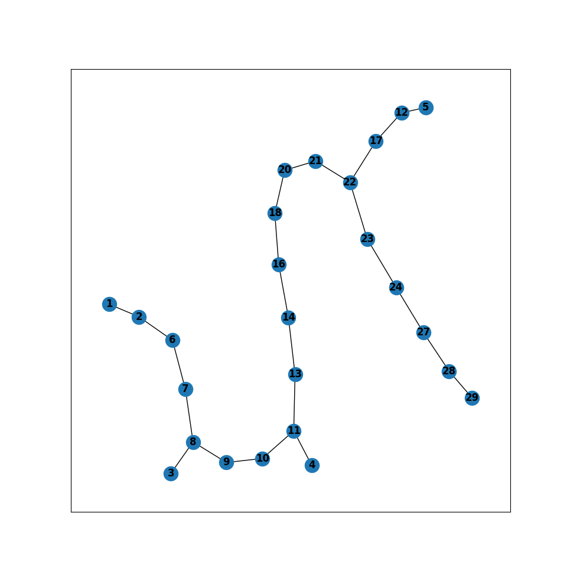

## results of various matrix sizes

input scalar field is
```python
 [[ 1 13  5  6]
 [ 9 20 19  7]
 [ 2 12 14 16]
 [18 17 15 11]]
```


input scalar field is randomly spaced
```python
 [[21 27 14 11  4]
 [20  6 10 23 22]
 [ 7  1  9 24 17]
 [ 2  8 18 29 12]
 [13 16  3 28  5]]
```


input scalar field is
```python
 [[25 20 18  8 23]
 [29 27  1  6  2]
 [ 7 21  3 19 14]
 [17 28 13 24 22]
 [ 5 12  4 11 16]]
```


input scalar field is 6x6
```python
 [[38 11 40  2 16 17]
 [35 10 15 23  9 30]
 [37 27 33 25  1 31]
 [ 3 24  5  4 39 32]
 [28 13 21  6 18 14]
 [26  8 22 20 36 34]]
```

