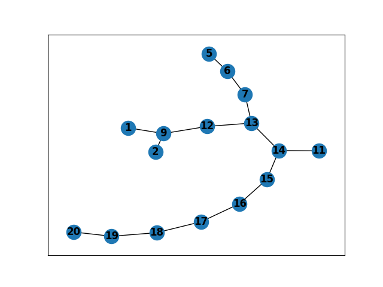

## results of various matrix sizes

input scalar field is 4x4
```python
[[ 9  7 13  5]
 [10 12  1  4]
 [11  8  3 15]
 [16  2  6 14]]
```


input scalar field is 5x5
```python
[[ 5 25 14 20 15]
 [ 8 10 19 13 11]
 [23 12 16  4  1]
 [ 7 22  6 17 21]
 [ 9  2 18 24  3]]
```


input scalar field is 6x6
```python
[[23  1 32 13  4 22]
 [ 2 28  7 15 10 34]
 [ 8 12 17 14 36 27]
 [35 25 18 29 26  6]
 [19 31 11 21  9 33]
 [ 5 30 24 16 20  3]]
```
